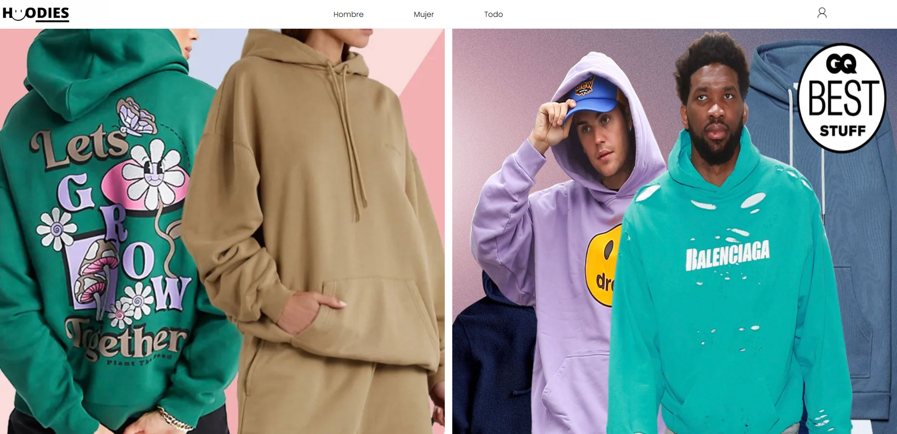
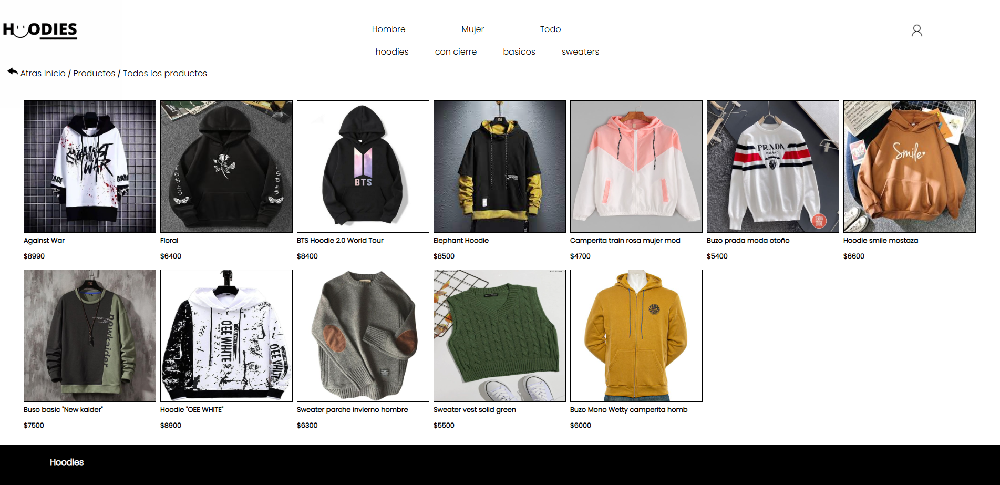
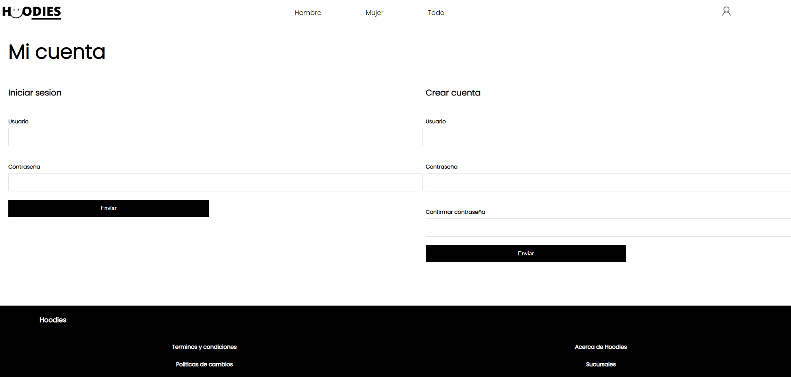

# Hoodies E-Commerce & API

## Description
Hoodies is a **clothing e-commerce project**.  
It is built with **PHP** using the **MVC pattern**, a custom router, and the **Smarty** templating engine.  

The project demonstrates routing, CRUD operations for products and categories, and user authentication with admin roles.  
It also provides a simple **RESTful API** to interact with products programmatically, which can be tested via Postman or other API clients.

---

## Technologies

- **PHP 8.1+**
- **MySQL / MariaDB 10.4+**
- **Smarty** (included in `libs/Smarty.class.php`)
- MVC design pattern
- HTML, CSS, JavaScript
- Custom PHP Router

---

## Requirements

- **XAMPP** (or any Apache + MySQL/MariaDB environment)
- PHP extensions: PDO, mbstring, session support
- Modern web browser (Chrome, Firefox, Edge, etc.)

---

## Installation & Setup

1. Download the project and copy it into the `htdocs` folder of XAMPP.  
   > In XAMPP, open **Explorer**, find the `htdocs` folder, and paste the project there.

2. Import the database `db_hoodies.sql` into **phpMyAdmin** to create the database and tables.

3. Start **Apache** and **MySQL** from the XAMPP control panel.

4. Access the project in your browser: http://localhost/Hoodies

5. Admin credentials for testing:
- **Username:** `admin`
- **Password:** `123`

---

## Project Structure

hoodies/
├─ api/
├─ app/
│ ├─ controllers/
│ ├─ models/
│ ├─ views/
│ └─ helpers/
├─ css/
├─ db/
├─ images/
├─ js/
├─ libs/
├─ resources/
├─ templates/
├─ .htaccess
├─ route_api.php
├─ route.php
└─ index.html

---

## Web Routes

- `/home` → Main page  
- `/men` → Men's clothing section  
- `/women` → Women's clothing section  
- `/store/{category}/{type?}` → List products filtered by category and optional type  
- Admin panel: create, edit, delete products and categories (requires admin login)

---

## API Documentation

### Base URL
http://localhost/Hoodies/api

### Endpoints

#### Products

| Method | Endpoint | Description |
|--------|----------|-------------|
| GET    | `/productos` | Returns all products |
| POST   | `/productos` | Creates a new product |
| GET    | `/productos/:ID` | Returns a specific product by ID |
| PUT    | `/productos/:ID` | Updates a product by replacing its information |
| DELETE | `/productos/:ID` | Deletes a specific product by ID |

#### Query Parameters

- Filter by category:
api/productos/?id_categoria=1|2|3|4

  - 1 = Hoodies  
  - 2 = Con cierre  
  - 3 = Basicos  
  - 4 = Sweaters

- Sort by product ID:
api/productos/?orderID=asc|desc

- Pagination (3 products per page):
api/productos/?page=1|2|3|...

---

## Screenshots

> Home Page

  

> Store Page
> 
  

> Login Panel
> 

---

## Notes

- The router handles all URLs, so you do not need to append `/home` manually.  
- `session_start()` is used for authentication functions.  
- The project is suitable for portfolio demonstration as an example of a PHP MVC application with an admin panel and RESTful API.

---

## Author

- Facundo Pancani
